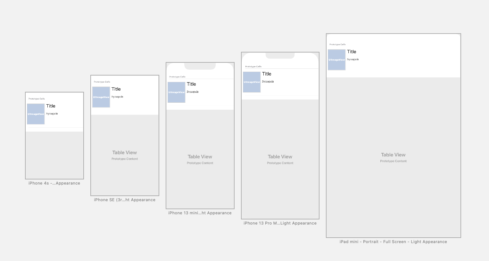

# Flix, for CodePath by Nick Melkadze

Flix is an app that allows users to browse movies from the [The Movie Database API](http://docs.themoviedb.apiary.io/#).

## Flix Part 2

### User Stories

#### REQUIRED (10pts)
- [x] (5pts) User can tap a cell to see more details about a particular movie.
- [x] (5pts) User can tap a tab bar button to view a grid layout of Movie Posters using a CollectionView.

#### BONUS
- [ ] (2pts) User can tap a poster in the collection view to see a detail screen of that movie.
- [ ] (2pts) In the detail view, when the user taps the poster, a new screen is presented modally where they can view the trailer.

### App Walkthrough GIF
Please give the gif a few seconds to load; it will show up blank until then.

 

### Notes
My biggest challange with implementing Part 2 of this app was when one of the connections was not working, with Xcode reporting that information about the MovieGridCell class could not be found. After troubleshooting, I found out that the way to solve the problem is to run Product > Clean, and then build the project. After doing so, the connection was able to be made.

---

## Flix Part 1

### User Stories

#### REQUIRED (10pts)
- [x] (2pts) User sees an app icon on the home screen and a styled launch screen.
- [x] (5pts) User can view and scroll through a list of movies now playing in theaters.
- [x] (3pts) User can view the movie poster image for each movie.

#### BONUS
- [x] (2pt) User can view the app on various device sizes and orientations.
- [x] (1pt) Run your app on a real device.

### App Walkthrough GIF
Please give the gif a few seconds to load; it will show up blank until then.

 

In order to provide the best demonstration of multiple sizes, I have included this screenshot (click to enlarge):

 

### Notes
The main challange I encountered with building this app involved the fact that I renamed some of the elements after I made connection with them by control-dragging. I was able to identify them however, and simply recreated the connections, and the new names funcitoned properly.

In implementing the bonus stories, I had difficulty with getting a hand on the layout constraints. I tested a lot of different things with them, and now feel a lot more comfortable using contraints as a result.

Additionally, I was unable to compile for my phone's iOS 16 on my Macbook running last year's version (13, Monterey) through normal means! I felt I should write this down for others to be aware, and to provide [a link](https://dilumdesilva.medium.com/so-xcode-doesnt-support-your-iphone-s-os-version-here-s-how-to-fix-it-c2db7fd58468) to the guide I used to add support in an unofficial way.
